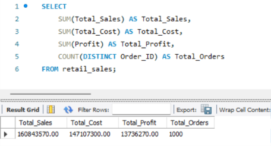
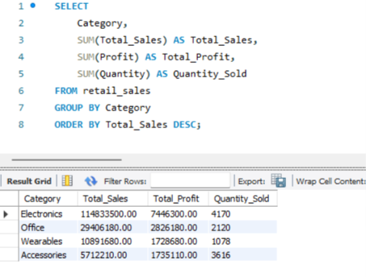
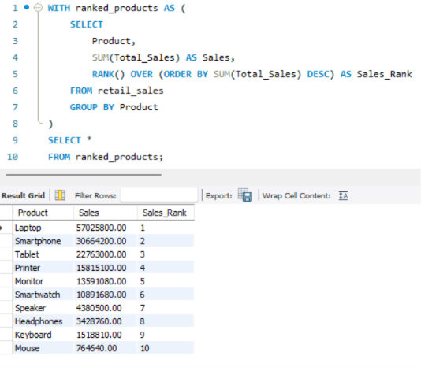

# 📊 Retail Sales SQL Analysis

## 📌 Project Overview

This project analyzes 1,000 retail sales transactions using MySQL
to understand sales performance, profitability, product performance,
customer behavior, regional trends, payment methods, and delivery status.

The project demonstrates practical SQL skills used in Data Analyst roles,
from basic data exploration to advanced analytical queries.

---

## 🎯 Business Objectives

- Analyze overall sales and profitability
- Identify top-performing products and categories
- Compare regional sales and profit performance
- Identify high-value and repeat customers
- Analyze payment methods
- Analyze delivery status
- Analyze monthly sales and profit trends
- Rank products within each category

---

## 🛠️ Tools & Technologies

- MySQL
- SQL
- MySQL Workbench

---

## 📂 Dataset

The dataset contains 1,000 retail transactions.

Key information includes:

- Order details
- Customer information
- Product and category information
- Location and region
- Quantity and pricing
- Discounts
- Sales and cost
- Profit
- Payment method
- Delivery status

---

## 🔍 SQL Skills Demonstrated

### Basic SQL
- SELECT
- WHERE
- ORDER BY
- DISTINCT

### Aggregation
- SUM()
- COUNT()
- GROUP BY
- HAVING
- AVG()

### Intermediate SQL
- CASE
- Subqueries
- Date functions

### Advanced SQL
- Common Table Expressions (CTEs)
- Window Functions
- DENSE_RANK()
- PARTITION BY
- Product ranking
- Top-N analysis

---

## 📊 Analysis Performed

### 1. Overall Sales Analysis

- Total sales
- Total profit
- Total orders
- Total quantity sold
- Overall profit margin

### 2. Category Analysis

- Sales by category
- Profit by category
- Category-wise profit margin
- Quantity sold by category

### 3. Regional Analysis

- Sales by region
- Profit by region
- Regional profit margins

### 4. Product Analysis

- Top 10 products by sales
- Top 10 products by profit
- Top 3 products within each category

### 5. Customer Analysis

- Top customers by sales
- Repeat customers
- Number of orders per customer

### 6. Payment Analysis

- Orders by payment method
- Sales by payment method

### 7. Delivery Analysis

- Orders by delivery status
- Delivery-status percentage

### 8. Time-Based Analysis

- Monthly sales
- Monthly profit
- Sales trends over time

---

## 💡 Key Insights

The SQL analysis was used to identify:

- Top-performing categories and products
- High-profit products and categories
- Regional sales and profitability differences
- High-value and repeat customers
- Popular payment methods
- Delivery-status distribution
- Monthly sales and profit patterns

---

## 📸 Project Screenshots

### Sales Analysis



### Category Analysis



### Advanced SQL Analysis



---

## 📁 Project Structure

```text
retail-sales-sql-analysis/
│
├── README.md
│
├── data/
│   └── retail_sales.csv
│
├── sql/
│   └── retail_sales_analysis.sql
│
└── screenshots/
    ├── sales_analysis.png
    ├── category_analysis.png
    └── advanced_sql.png
